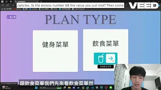

<h1>健人就是繳錢</h1>

<h2>Demo 影片</h2>
https://youtu.be/4ZZDVHnDfDA 

<h2>功能介紹</h2>

**會員專區**：查看並編輯個人資料，包含身高、體重、訓練強度等。除此之外，還能生成專屬於自己的「個人報告」，除了能看出自身去健身房的頻率，還能看出自己在哪種健身器材上進步幅度最大。

**菜單**：客製化個人健身與飲食計畫。健身計畫部分，依照自身想要訓練的程度、天數及部位，給出最適合你的健身清單；飲食計畫部分，則會依照你的身高體重，搭配系統極具專業的營養公式，列出水、蛋白質、熱量等五項基本物質每日建議攝取量。

**紀錄**：為了防止如系統開發者般有著金魚腦的人，貼心地能讓使用者查詢某天做了甚麼器材、練了哪個部位。或是你想查詢某天的飲食紀錄也是可以的攸！

**搜尋**：想知道離你最近的健身房嗎？想知道哪間健身房有你想要的器材嗎？想知道哪間健身房有你想要上的課嗎？想知道最適合你的教練在哪裡嗎？那就搜尋吧！

**GYPT**：有著類似於ypt的分享功能，能即時看到同在健身的人們，也可以看到各大排行榜，看看厲害的你，有沒有名列在各大高手前。
